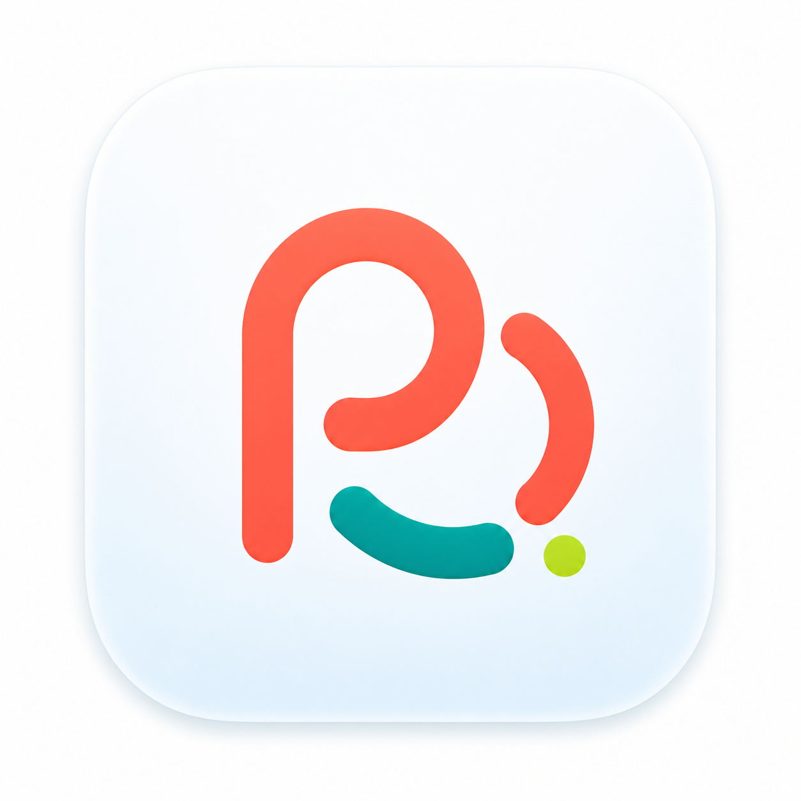

# Pordee Logo Direction

This document records the current logo direction for the `พอดี / Pordee` rebrand.

Historical note: this repo was previously branded as `TangMod / ตังค์หมด`. Old TangMod logo files remain under `docs/images/logo-source/` as legacy source material.

## Selected Direction

Use the compact Option B semi-flat `P + D` loop mark as the primary logo
direction. This direction keeps the selected PD concept: coral loop monogram,
teal balance smile, and tiny lime milestone dot, but tightens the negative
space and app-icon silhouette.

Current strategy and exploration:

- `rebrand-direction.md`
- `source/rebrand-source/pordee-brand-board.svg`
- `source/rebrand-source/pordee-mascot-contact-sheet-v1.png`

## Logo Principles

- The main logo is the compact Option B semi-flat `P + D` loop mark in `app/public/logo/pordee-pd-logo.png`.
- `Pordee` is English support text for URLs, app stores, and bilingual contexts.
- The product UI font is `IBM Plex Sans Thai`.
- The coral loop is the key action detail.
- The teal balance path is the positive-progress detail.
- The lime dot is a tiny milestone highlight only.
- Avoid returning to the earlier inflated 3D/glossy gel rendering.
- The logo should feel friendly, Thai-first, and practical.
- The mascot should not be the main logo.
- The app icon should use the square loop-and-balance mark.

## Color Usage

- Wordmark: charcoal `#172026`
- Primary accent: coral `#FF6B5A`
- Support accent: teal `#18A999`
- Tiny highlight only: lime `#B7F34A`
- Background: sky `#EAF7FF`
- Surface: white `#FFFFFF`

Coral is the primary accent. Lime must remain a small highlight, not the main logo color.

## Production Assets

Current final visual direction:

- `assets/logo/pordee-option-b-pwa-icon-concept.png`
- `app/public/logo/pordee-pd-logo.png`

The imagegen PWA icon in `assets/logo/` is the approved source. The runtime PNG
is generated from it by the icon pipeline.

Historical SVG candidates remain under `source/rebrand-source/production/`, but they are no longer the active logo direction.

Mascot production candidate SVG files:

- `source/rebrand-source/production/mascots/pordee-mascot-normal.svg`
- `source/rebrand-source/production/mascots/pordee-mascot-happy.svg`
- `source/rebrand-source/production/mascots/pordee-mascot-saving.svg`
- `source/rebrand-source/production/mascots/pordee-mascot-warning.svg`
- `source/rebrand-source/production/mascots/pordee-mascot-thinking.svg`

When the app needs stable public asset paths, copy the final logo asset or its traced production SVG into `public/`.

Legacy TangMod files still exist in `docs/images/logo-source/` for historical comparison, but they should not be used for new Pordee implementation.

## Do Not Use

- Do not use the old glossy logo or raw generated board PNG as the final logo.
- Do not use previous PD SVG candidates as the active logo unless they are retraced from the selected semi-flat PNG.
- Do not use old TangMod traced logo files for new Pordee implementation.
- Do not make the mascot the primary logo.
- Do not use wallet, piggy bank, chart, or generic bank symbols.
- Do not return to cream, warm yellow, or dark forest green as the dominant logo palette.

## Implementation Status

Phase 1 progress (in `app/`):

- Sized rasters generated from the approved source image via `app/scripts/build-icons.mjs`:
  - `app/public/brand/icon-32.png` (browser favicon companion)
  - `app/public/brand/icon-180.png` (apple-touch-icon)
  - `app/public/brand/icon-192.png`, `icon-512.png` (PWA manifest)
  - `app/public/brand/icon-maskable-512.png` (PWA maskable, sky-padded safe zone)
  - `app/public/favicon.ico` (16/32/48 multi-size)
- `vite.config.ts` PWA manifest and `root.tsx` link tags reference these sized
  icons directly. Run `pnpm icons:build` after replacing the approved source image.
- `app/components/brand/logo.tsx` renders the sized raster as a placeholder
  with a `variant: 'light' | 'dark'` prop for future on-dark placements.

Still on hold (requires hand work, not auto-generation):

- Trademark- and app-store-grade vector exports.

Phase 2 progress:

- Production SVG trace of the selected semi-flat mark has been hand-authored at
  `source/rebrand-source/production/logo/pordee-logo-mark.svg`.
- Inline-SVG React component `PordeeLogoMark` lives at
  `app/app/components/brand/logo-mark.tsx` and is used by `PordeeLogo` for
  crisp UI chrome.
