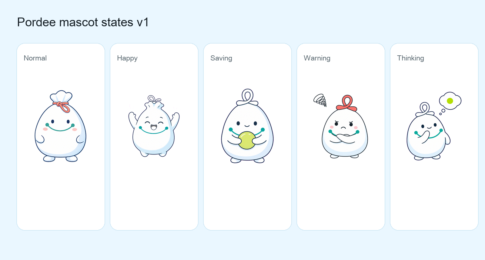
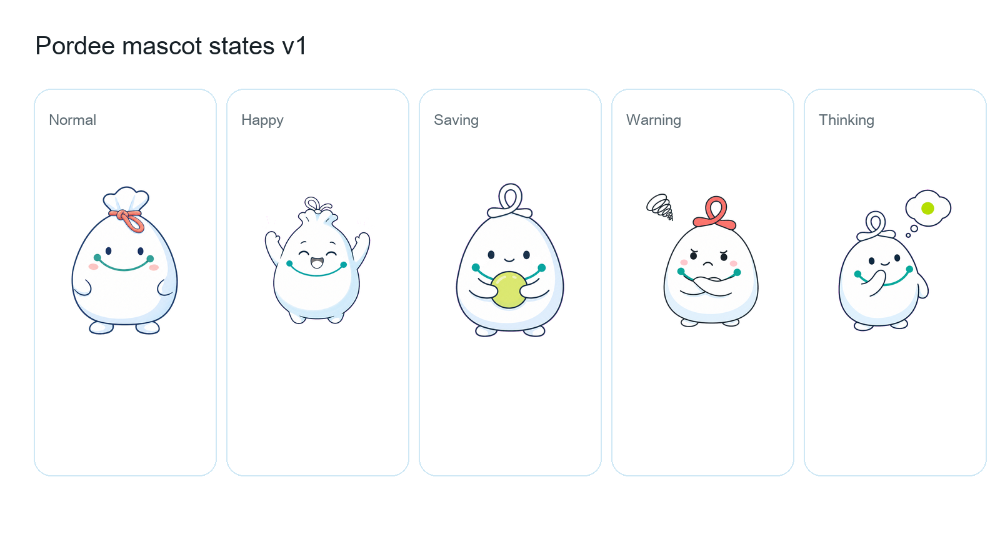

# Pordee Mascot V1 Assets

This folder contains the first generated mascot asset pack for the `พอดี / Pordee` rebrand direction.

The files are generated concept assets, then locally processed into transparent PNGs from magenta chroma-key sources. Use them for visual review and early UI trials. Before final production, refine character consistency across states and create final hand-cleaned assets.

## Contact Sheets

## Final Transparent PNGs

| State | Final asset | Chroma-key source | Sky preview | White preview |
| --- | --- | --- | --- | --- |
| Normal | `pordee-mascot-normal.png` | `pordee-mascot-normal-source.png` | `pordee-mascot-normal-preview-sky.png` | `pordee-mascot-normal-preview-white.png` |
| Happy | `pordee-mascot-happy.png` | `pordee-mascot-happy-source.png` | `pordee-mascot-happy-preview-sky.png` | `pordee-mascot-happy-preview-white.png` |
| Saving | `pordee-mascot-saving.png` | `pordee-mascot-saving-source.png` | `pordee-mascot-saving-preview-sky.png` | `pordee-mascot-saving-preview-white.png` |
| Warning | `pordee-mascot-warning.png` | `pordee-mascot-warning-source.png` | `pordee-mascot-warning-preview-sky.png` | `pordee-mascot-warning-preview-white.png` |
| Thinking | `pordee-mascot-thinking.png` | `pordee-mascot-thinking-source.png` | `pordee-mascot-thinking-preview-sky.png` | `pordee-mascot-thinking-preview-white.png` |

## Usage Notes

- Use final transparent PNG files for UI trials, not the `*-source.png` files.
- Use `normal` for neutral empty states and dashboard helper moments.
- Use `happy` for successful transaction capture or positive confirmation.
- Use `saving` for savings goals and progress encouragement.
- Use `warning` for overspending, unusual spending, or recoverable errors.
- Use `thinking` for assistant tips, onboarding, and explainers.
- Keep mascot usage sparse so it supports product clarity instead of crowding finance data.

## QA Notes

- Transparent alpha is present on every final PNG.
- Previews on sky and white backgrounds have been generated for quick edge checks.
- V1 is good enough for direction and UI mockups.
- Before production, refine consistency of the top loop/knot across states, especially `normal` and `happy`.
